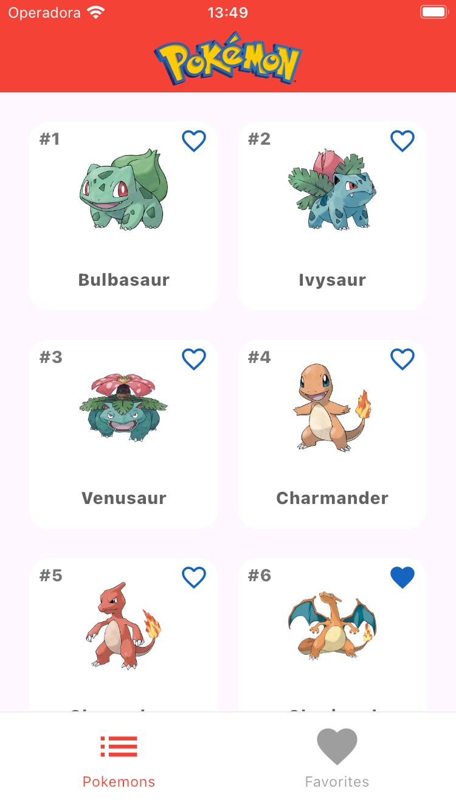
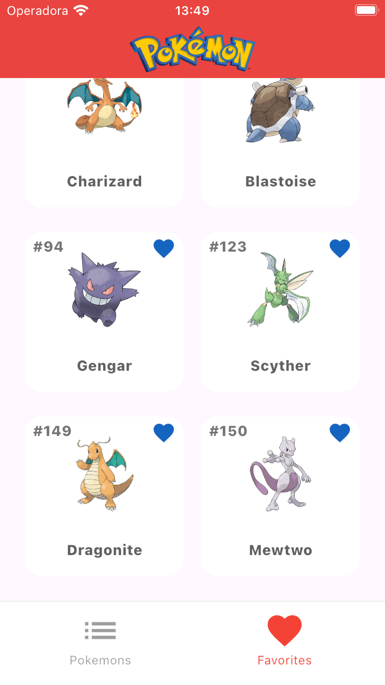
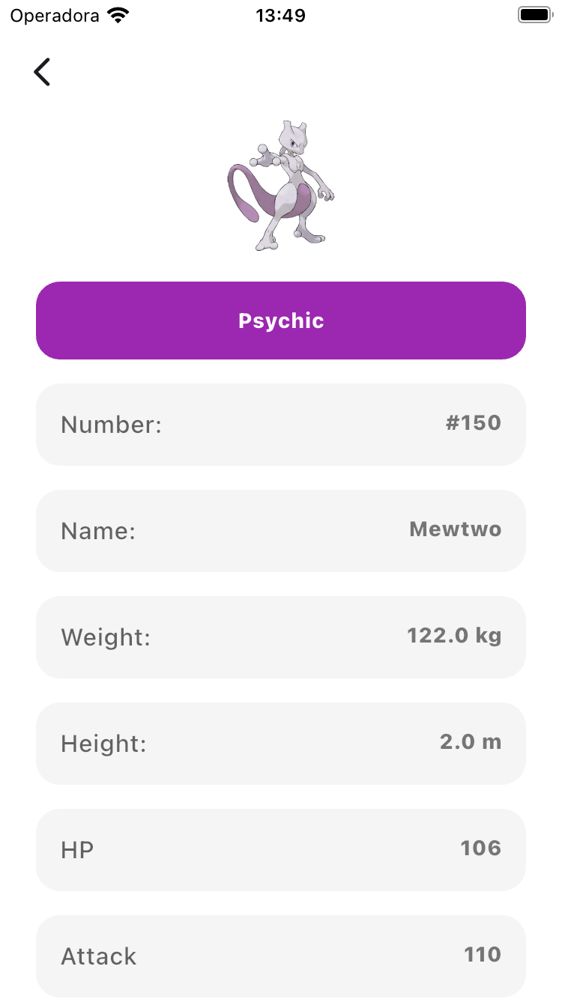

# Pokémon App

This is a Flutter application to display information about Pokémon, using Clean Architecture and the `sqflite` package for local storage.

## Project Structure

The project follows the Clean Architecture structure, dividing the code into distinct layers to ensure separation of concerns and maintainability. The main layers are:

- **domain**: Contains the core business logic, including entities, repositories, and use cases.
- **data**: Responsible for data management, including data sources (local and remote), models, and repository implementations.
- **presentation**: Manages the UI and user interaction, including widgets, pages, and state management.

## Dependencies

- **sqflite**: Used for SQLite database operations in Flutter. It allows storing and retrieving data locally.
- **path**: Provides functions for manipulating file and directory paths in a platform-independent way.
- **cached_network_image**: Used to load and cache images from the web, improving performance and user experience.
- **rxdart**: An extension of the `dart:async` package that adds support for reactive programming with Streams.
- **mockito**: Used to create mocks in unit tests, allowing you to simulate the behavior of dependencies.
- **get_it**: A dependency injection (DI) container for Flutter and Dart, used to manage and inject dependencies.
- **dio**: A powerful and easy-to-use HTTP client for Dart, used to make HTTP requests.
- **cupertino_icons**: A set of iOS-style icons for Flutter, used to add Cupertino-style icons.
- **lottie**: Used to render Lottie animations in Flutter, allowing you to add complex and interactive animations.
- **flutter_svg**: Used to render SVG files in Flutter, allowing you to add scalable vector graphics.
- **dartz**: A functional programming library for Dart, providing types and functions for functional programming.

## API used in the project

- The application consumes the Poké API (https://pokeapi.co)

## About the Application

- The application features a TabBar with 2 tabs.

- The first tab displays a paginated list of all existing Pokémon, retrieved from the Poké API. In this tab, users can favorite or unfavorite Pokémon of their choice. The favorites are saved in a local database managed by the `sqflite` library.

- The second tab shows a list of all Pokémon favorited by the user, with the option to remove a Pokémon from the favorites list.

- Users can also view detailed information about a Pokémon by selecting it from the main list or from the favorites tab.

## Images and GIF

